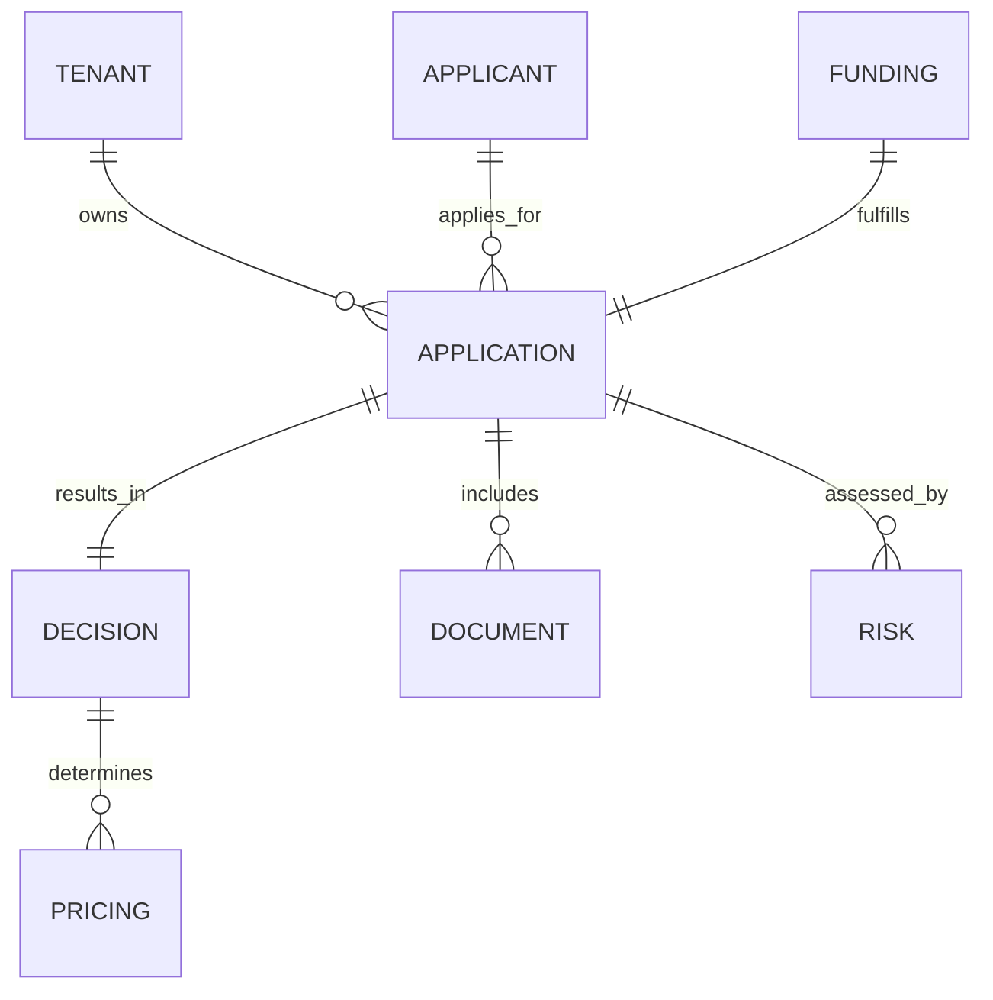

plutus/docs/DATA_MODEL.md
# Canonical Domains & Data Contracts

## Entities
Tenant, Applicant, Application, Financials, Decision, Risk, Documents, Funding, Audit/Event.

## Events (AsyncAPI + Avro/Protobuf)
application.created, intake.completed, kyc.completed, kyb.completed, fraud.evaluated, features.ready, decision.requested, decision.completed, docs.packaged, esign.completed, funding.released.

Each event includes: tenant, residency tag, idempotency key, PII token refs, model/policy hashes (as applicable).

## Mermaid Entity Diagram (High-Level)

