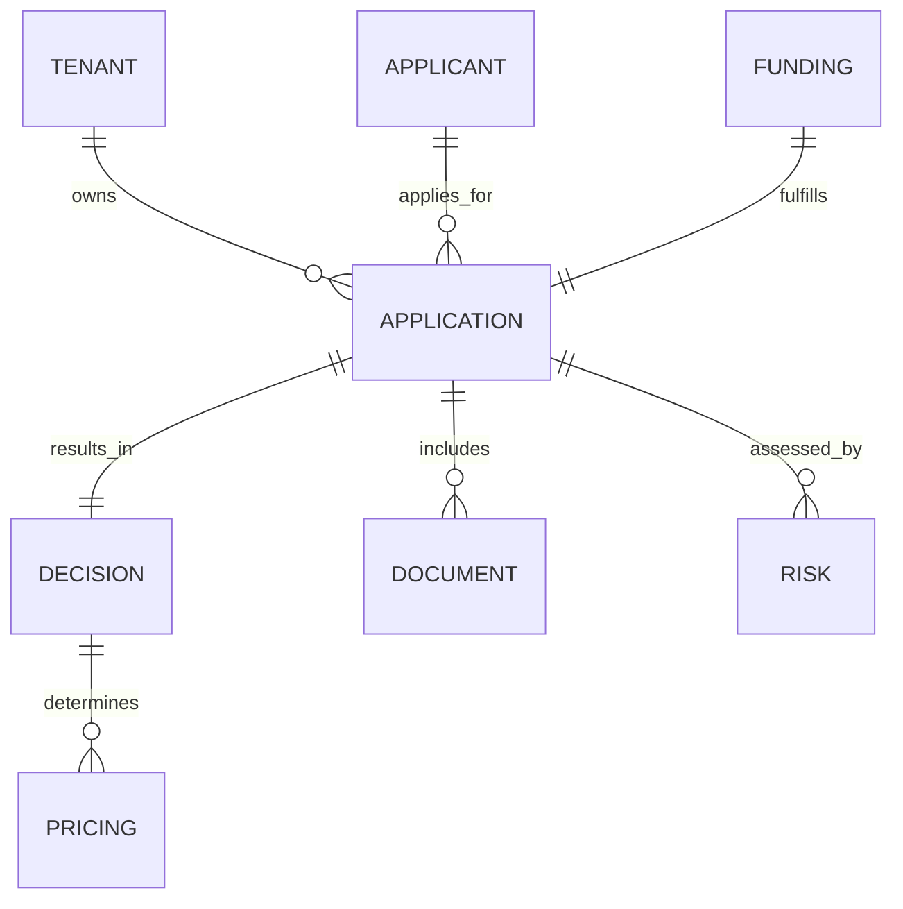

plutus/docs/DATA_MODEL.md
# Canonical Domains & Data Contracts

## Entities
Tenant, Applicant, Application, Financials, Decision, Risk, Documents, Funding, Audit/Event.

## Events (AsyncAPI + Avro/Protobuf)
application.created, intake.completed, kyc.completed, kyb.completed, fraud.evaluated, features.ready, decision.requested, decision.completed, docs.packaged, esign.completed, funding.released.

Each event includes: tenant, residency tag, idempotency key, PII token refs, model/policy hashes (as applicable).

> **Contracts**: `contracts/events/lifecycle.asyncapi.yaml`, `contracts/events/schemas/*.avsc`. AsyncAPI + Avro enforce tenant residency, audit, and policy metadata for automation.

## HTTP Services

- Intake API — `contracts/http/intake.openapi.yaml`
- Configuration API — `contracts/http/config.openapi.yaml`
- IAM API — `contracts/http/iam.openapi.yaml`

All services embed residency headers, OAuth2 scopes, and standardized error envelopes for cross-team integration.

## Mermaid Entity Diagram (High-Level)

