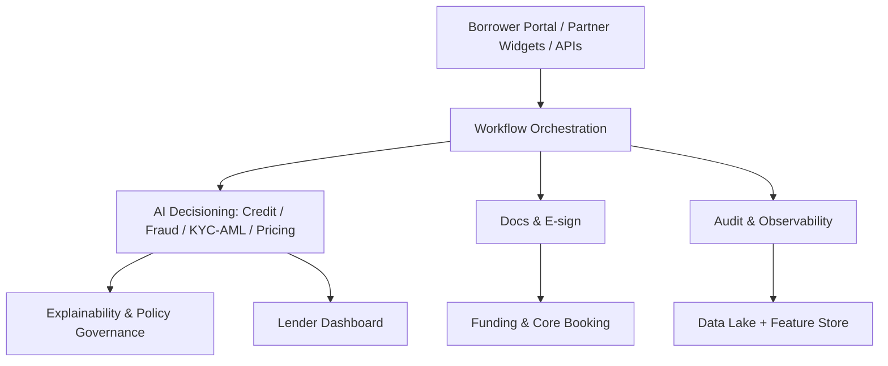

plutus/docs/OVERVIEW.md
# Plutus — Ultimate AI Loan Origination Platform (US & EU)
**Version:** 1.0 • **Date:** 2025-10-03

## Purpose
Enterprise-grade, AI-first loan origination for SMB & mid-market enterprise lending across US/EU.

## Positioning
Combines AI underwriting, KYB/KYC/AML, fraud, workflow/orchestration, borrower UX, and deep bank/core integrations.

## Guiding Tenets
- Compliance-by-design
- Explainable-by-default
- Event-driven, API-first
- Multi-tenant, multi-region (US/EU)
- Observable and cost-aware

## Value Streams
1. **Acquisition & Intake** — High-conversion borrower portal, embedded (partner/broker) flows, zero-friction data pulls.  
2. **Qualification & Decisioning** — AI/NLP doc ingestion → normalized features → credit/fraud/KYC decisions with explainability & bias controls.  
3. **Underwriter Efficiency** — Exception-only queues, AI memos, policy sandboxing, experiments.  
4. **Funding & Booking** — Doc generation/e-sign, collateral & covenant checks, core booking, GL posting, notifications.  
5. **Governance & Auditability** — Immutable event log, reproducible decisions, lineage for data & models, regulator-ready reporting.

## High-Level Architecture (Text)
User Layer → Application & Workflow Layer → AI & Decisioning Layer → Data & Integration Layer → Infrastructure Layer

## High-Level Architecture (Mermaid)

